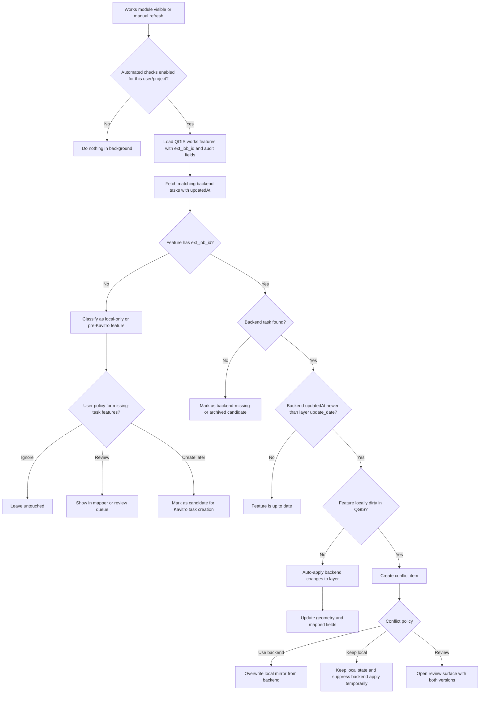
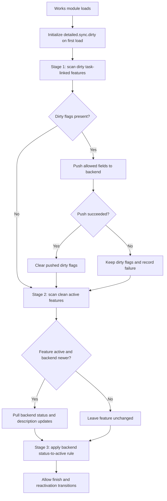

# Geospatial Auto Setup Design Log

Purpose: track decisions, open questions, phased rollout logic, and UI placement for the new Geospatial-assisted setup flow in Settings.

## Current Goal

Add an optional Settings flow that can automatically configure QGIS layer connections and related setup values when the customer uses Geospatial services.

This must not replace the current standalone Kavitro setup flow.

## Non-Negotiable Constraints

- Standalone setup must remain fully supported.
- Geospatial-assisted setup must be optional.
- Existing customers who do not use Geospatial services must see the current setup behavior unchanged by default.
- The feature must start as a guided trigger + dialog flow, not as implicit background auto-configuration.
- When Geospatial mode is active, the project base layer manual widgets should be hidden or disabled to avoid mixed configuration states.
- Until the dialog logic is fully designed, track decisions here first and implement in small steps.

## Recommended Trigger Placement

Recommended first placement:

- Add the trigger inside `SettingsProjectBaseLayersCard`.
- Place it near the top of the card, directly below the description and above the current manual enable checkbox.
- Treat this card as the owner of the Geospatial setup mode because it already owns the project base layer configuration surface that will be replaced or suppressed.

Why this is the best first placement:

- The Geospatial flow directly competes with the current project base layer setup.
- Users will understand the replacement relationship immediately when the trigger sits in the same card.
- This avoids scattering setup ownership across unrelated Settings cards.
- It keeps the first implementation local and reversible.

Alternative placement considered:

- A separate standalone "Geospatial integration" Settings card.

Why not first:

- It splits one concern across two cards.
- It makes hide/disable behavior for the project base layer widgets less obvious.
- It adds more UI surface before the dialog contract is known.

## First UX Concept

Inside `SettingsProjectBaseLayersCard`:

- Add a small status row describing the current setup mode.
- Add a trigger button, for example: `Connect via Geospatial`.
- Add a secondary action only later if needed, for example: `Return to manual setup`.

Initial mode model:

- Manual mode:
  - current standalone widgets visible
  - current behavior unchanged
- Geospatial mode:
  - manual project base layer widgets hidden or disabled
  - card shows that setup is managed through Geospatial integration
  - dialog becomes the canonical way to configure these values

## First Dialog Scope

The first dialog should not try to solve every setup case.

Step 1 dialog goals:

- explain what Geospatial-assisted setup will control
- explain that manual project base layer setup will be disabled while this mode is active
- let the user confirm entering Geospatial mode
- capture only the minimum required integration choices
- write state in a way that allows returning to manual mode later

The dialog should initially configure only the values that are already safe and clearly owned.

Examples of future values the dialog may control:

- project base layer assignments
- sewer mapping defaults
- module-specific layer defaults
- hardcoded defaults currently scattered in setup flows
- component toggles that depend on Geospatial conventions

But those should be introduced in phases, not all at once.

## Configuration Model To Keep Clean

Avoid mixed state.

Preferred high-level state:

- `setup_mode = manual | geospatial`
- `geospatial_enabled = true/false`
- `geospatial_profile = <optional future identifier>`
- `geospatial_managed_fields = [...]` or equivalent internal ownership mapping if later needed

Important behavior rule:

- when `setup_mode == geospatial`, the manual project base layer widgets should not remain editable
- when user switches back to `manual`, the standard standalone widgets become the source of truth again

## Suggested Implementation Phases

### Phase 0: Design and tracking

- decide trigger placement
- define mode ownership
- define what gets hidden or disabled first
- list all setup values that could later move under Geospatial management
- do not overbuild dialog logic yet

### Phase 1: UI trigger only

- add trigger row to `SettingsProjectBaseLayersCard`
- add lightweight mode state display
- no real integration logic yet
- clicking trigger opens placeholder dialog
- dialog text explains future Geospatial-managed setup scope

### Phase 2: Mode switching behavior

- persist Geospatial/manual mode
- hide or disable project base layer manual widgets when Geospatial mode is enabled
- add explicit way to return to manual mode
- keep current manual data untouched unless the user confirms replacement behavior

### Phase 3: First real automated assignments

- define exact layer matching rules
- define what defaults are written automatically
- apply only a safe subset first
- surface summary of what was changed

### Phase 4: Expanded Geospatial-managed setup

- move additional setup values under dialog control
- reduce hardcoded setup assumptions
- make ownership explicit in code and in UI text

## Suggested Owning Files For Future Steps

Likely first-touch files:

- `modules/Settings/cards/SettingsProjectBaseLayersCard.py`
- `modules/Settings/SettingsUI.py`
- `modules/Settings/SettinsUtils/SettingsLogic.py`
- `constants/settings_keys.py`
- `languages/translation_keys.py`
- `languages/en.py`
- `languages/et.py`

Likely new files later if needed:

- `modules/Settings/cards/GeospatialSetupDialog.py`
- `modules/Settings/geospatial_setup_service.py`
- `modules/Settings/geospatial_setup_state.py`

Note: do not create these until the dialog contract is clearer.

## Decisions Made So Far

- The first trigger should live in `SettingsProjectBaseLayersCard`.
- Geospatial setup is optional and must not replace standalone setup globally.
- Entering Geospatial mode should hide or disable the project base layer manual widgets.
- The dialog will be designed incrementally.
- This file is the canonical running note for the design path.

## Open Questions

- Should Geospatial mode be enabled per project, per user, or globally for the plugin profile?
- When switching from manual to Geospatial mode, should we preserve manual values silently, snapshot them, or ask the user?
- Should returning to manual mode restore last manual values automatically?
- What exact layers are controlled first by the dialog?
- Which current hardcoded defaults should become Geospatial-managed first?
- Does Geospatial setup also need to configure module label defaults or only layer-related setup?
- Do we need one Geospatial profile or multiple provider presets later?
- How visible should Geospatial mode be outside Settings?

## Risks To Avoid

- mixed manual + Geospatial editable state at the same time
- hidden background writes without user confirmation
- scattering setup logic across multiple cards too early
- introducing a large dialog before the ownership model is agreed
- silently overwriting existing customer setup

## Working Notes Template

Use this section to append small design updates as decisions arrive.

### Update Entry Template

- Date:
- Decision:
- Why:
- Files likely touched:
- Open follow-up:

## Next Recommended Step

Implement only the trigger row and a placeholder dialog shell in `SettingsProjectBaseLayersCard`, with no automatic setup writes yet.

## Task Change Monitoring Planning

Context for next design step:

- Kavitro task list payloads already expose `updatedAt`.
- QGIS-side map layers may be edited by this plugin, by direct QGIS editing, or by imported legacy layers.
- Some QGIS features may not yet have a Kavitro task at all.
- Not every user should necessarily get background monitoring from day one.

This means the problem is not only technical sync.

It is an ownership + UX problem with at least four states:

- Kavitro-backed task changed in backend and QGIS is only a viewer/editor client.
- QGIS user changed geometry or attributes locally and backend has not been updated yet.
- Another external counterpart changed the task in backend and QGIS must react without assuming plugin ownership.
- QGIS has a feature that does not yet have a Kavitro task id.

## Recommended Monitoring Model

Recommended source-of-truth rule:

- Backend is source of truth for shared task state.
- QGIS layer is the local working mirror.
- Local QGIS edits are provisional until pushed or explicitly accepted as local-only.
- If a feature has no Kavitro task id, it must be treated separately from normal backend sync.

Recommended technical checkpoints:

- Store last known backend change time in the layer-side audit fields already in use.
- Compare backend `updatedAt` against the layer-side mirrored update timestamp.
- Track whether the QGIS feature is locally dirty.
- Detect the missing-task case explicitly instead of treating it as a sync failure.

## BPMN-Style Process

The following BPMN-style flow is the current recommended planning model for Works first.



## Actor Cases To Design Explicitly

### Case 1: Kavitro plugin initiated the change

- Example: user changes status or geometry from inside the plugin.
- Desired behavior:
  - backend update succeeds
  - layer mirror is updated immediately
  - no warning UI needed
- Risk:
  - duplicate refresh or false conflict if the same change later comes back from backend polling

### Case 2: QGIS initiated the change

- Example: user changes geometry or mapped fields directly in QGIS.
- Desired behavior:
  - feature is marked locally dirty
  - plugin knows this is not yet confirmed by backend
  - later backend polling must not silently overwrite if there is a conflict
- Risk:
  - silent loss of local edits if background apply runs too aggressively

### Case 3: External counterpart initiated the change

- Example: other Kavitro user, office user, or connected process updates the task.
- Desired behavior:
  - backend newer than layer mirror triggers refresh logic
  - safe changes apply automatically when local feature is not dirty
  - risky changes enter review queue when local edits exist
- Risk:
  - too many popups if many tasks changed remotely

### Case 4: QGIS feature has no Kavitro task yet

- Example: legacy imported feature, pre-migration item, or local draft.
- Desired behavior:
  - do not treat as sync error
  - classify as one of:
    - local-only draft
    - migration candidate
    - task-creation candidate
- Risk:
  - background monitoring accidentally spams the user with false “missing backend task” alarms

## UX Recommendation

Do not design this as repeated modal warnings.

Recommended UX layers:

- Silent background apply for safe backend-only updates.
- Small non-blocking refresh summary for bulk safe updates.
- One review queue or review panel for conflicts and missing-task items.
- Optional map highlight or badge for items needing attention.

Recommended feedback levels:

- `silent`: safe auto-update, no popup
- `info banner`: “4 Works items refreshed from backend”
- `attention queue`: conflict or missing-task review needed
- `manual dialog`: only when the user actively opens the review surface

## Rollout Decision: Who Gets Automated Checks?

This must be explicitly decided before implementation.

Recommended rollout order:

- Phase A: disabled by default for everyone
- Phase B: enabled only for selected pilot users or selected customer environments
- Phase C: opt-in per user or per project profile in Settings
- Phase D: broader default enablement only after conflict handling proves stable

Recommended first implementation rule:

- automated checks should be behind a setting, not globally forced
- the setting should likely support at least:
  - off
  - manual refresh only
  - automatic checks while module is open

Avoid first rollout options like:

- always-on polling for every user
- background sync when the module is not even in use
- automatic overwrite of locally dirty features

## Open Planning Questions For This Slice

- Should automated checks be controlled per user, per QGIS profile, per project, or per module?
- Should the first release monitor only Works or also other task-backed modules?
- What is the exact definition of a locally dirty feature in QGIS?
- Which fields are safe for silent backend overwrite, and which require review?
- Should missing-task QGIS features be shown in the mapper flow, a sync review flow, or both?
- Do we want a dedicated review dock/widget later, or keep first review inside a dialog?

## Recommended First Technical Slice After Planning

Do not build full conflict UX first.

Build in this order:

- add a lightweight freshness scan for Works
- classify features into:
  - up to date
  - safe to auto-update
  - conflict review needed
  - no Kavitro task linked
- surface only aggregated counts in UI first
- postpone full review UI until the classification model is stable

## Proposed Dirty State Contract

New concrete proposal for Works first:

- use the Geospatial-provided `detailed` field as the sync state carrier
- store a dirty-state object inside `detailed`
- on first load of a legacy or newly attached Works feature, initialize the tracked dirty flags to `true`
- after first initialization, the sync engine decides which flags remain dirty and which are cleared after successful backend push or backend refresh

Recommended shape inside `detailed`:

```json
{
  "sync": {
    "initialized": true,
    "dirty": {
      "status": true,
      "files": true,
      "description": true,
      "dates": true
    },
    "lastBackendUpdatedAt": "2026-05-06T08:30:00+00:00",
    "lastSyncDirection": "backend_to_qgis | qgis_to_backend",
    "lastSyncAt": "2026-05-06T08:35:00+00:00"
  }
}
```

Notes:

- This is a planning contract, not a final schema commitment yet.
- The main value is that local sync intent becomes explicit on the feature itself.
- `dirty` should represent QGIS-side uncertainty or pending push state, not merely “field exists”.

## First-Load Initialization Rule

Recommended first-load rule:

- when a Works feature is first encountered by the new sync engine and no `sync.initialized` marker exists in `detailed`
- initialize all tracked dirty states to `true`
- persist that initialization locally before normal staged sync decisions continue

Why this is acceptable as a first design step:

- old layers and migrated data cannot be trusted to already reflect backend state safely
- initializing everything as dirty forces the new engine to pass through a controlled first reconciliation
- this is safer than assuming imported or legacy values are already authoritative

Important caution:

- this first-load policy should likely apply only once per feature under the new sync model
- repeated reinitialization would create sync loops and constant false-positive dirty states

## Works Module Load: Three-Stage Process

Current recommended staged process when the Kavitro plugin loads the Works module:

### Stage 1: Push dirty QGIS states to backend

- scan Works features that have a Kavitro task id
- inspect `detailed.sync.dirty`
- if any tracked state is dirty, push only the allowed fields from QGIS to backend

Allowed first-stage push scope:

- status
- add new files
- add or update description
- update date fields

Notable exclusion for first stage:

- do not broaden immediately to every attribute in the layer
- keep the first push scope intentionally narrow and auditable

After successful push:

- clear only the dirty flags that were actually pushed successfully
- update sync audit metadata in `detailed`

If push fails:

- keep dirty flags intact
- surface aggregated failure feedback, not repeated modal warnings

### Stage 2: Pull backend changes for active clean items

- look at features whose `dirty` flags are not set for the tracked fields
- restrict first polling scope to features whose map-side `active == true`
- fetch backend task data and compare backend `updatedAt`
- if backend is newer, update QGIS status and description-related fields from backend

Why restrict this stage to active clean items first:

- active items are operationally the most important to keep fresh
- this reduces background cost during first rollout
- it avoids overcomplicating the first monitoring pass with archived or clearly resolved tasks

### Stage 3: Keep Kavitro status-to-map completion logic intact

- preserve the existing rule that backend status changes can still mark the map feature finished
- specifically, Kavitro status changes must continue to control `active`
- if backend status type is closed, QGIS map state must still be allowed to move to inactive

Known complication:

- the same task may later be reactivated in backend
- the design must therefore support both transitions:
  - active -> inactive
  - inactive -> active

This means `active` must not be treated as write-once completion state.

## BPMN-Style Stage Flow



## Design Consequences Of This Proposal

- `detailed` becomes more than passive metadata; it becomes the first sync-state envelope
- first implementation can avoid a separate repository-wide sync-state store
- feature-level sync ownership becomes inspectable directly from the layer
- first rollout can stay Works-only while preserving later expansion to other task-backed modules

## New Open Questions From This Proposal

- Should `files` dirty mean only “new local files to upload”, or also deletions and metadata edits?
- Which exact date fields are allowed in the first push scope?
- Should stage 2 initially update only status + description, or also mirrored audit dates?
- Should inactive tasks be excluded entirely from stage 2, or checked less frequently instead of never?
- When a task is reactivated in backend, should QGIS clear any completion-only local defaults automatically?
- Do we want one shared `detailed.sync` schema across Works, Projects, and AsBuilt later, or allow module-specific variants?

## Working Update

- Date: 2026-05-05
- Decision: plan backend/QGIS/external ownership as a classified monitoring flow instead of immediate always-on sync
- Why: this problem is larger than simple polling because local edits, remote edits, and missing-task features must be handled differently
- Files likely touched: `modules/works/works_sync_service.py`, `modules/works/WorksUi.py`, Settings UI for rollout flags, and later a review dialog/dock
- Open follow-up: decide rollout scope for automated checks and the first UX surface for conflict + missing-task review

- Date: 2026-05-06
- Decision: use `detailed.sync.dirty` as the first explicit feature-level sync contract for Works and plan a three-stage module-load pipeline around it
- Why: this creates a concrete first implementation model without requiring a full separate sync-state store before the ownership rules are proven
- Files likely touched: `modules/works/works_sync_service.py`, `modules/works/works_layer_service.py`, Works UI load hooks, and later file/description update helpers
- Open follow-up: decide exact dirty-flag schema, which date fields are allowed in stage 1 push, and whether stage 2 should monitor only active tasks or all tasks with different cadence
